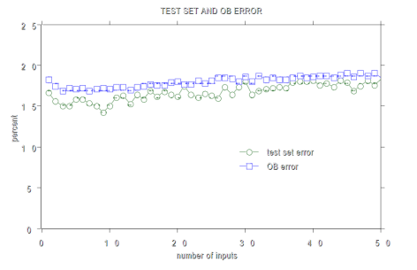
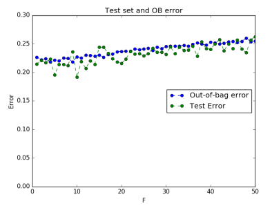
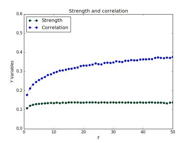

ML Advanced Project: Reimplementation of the original "Random Forest" paper
===================

Authors
---
This repository is being developed as part of the course [Machine Learning, Advanced Course (DT2434)](https://www.kth.se/student/kurser/kurs/DD2434?l=en) at [KTH Royal Institute of Technology](http://kth.se), in the Autumn 16 P2 round.

| Author               | GitHub                                            |
|:---------------------|:--------------------------------------------------|
| Diego Yus | [DYusL](https://github.com/DYusL)       |
| Sugandh Sinha | [sug4ndh](https://github.com/sug4ndh) |
| Hui Pang | [lnfc0218](https://github.com/lnfc0218) |
| Oktay Bahceci |  |

Description
---
Random forest is a classical ensemble method for classification and regression. It is a strong classifier consisting of a set of relatively weak decision trees, where each tree is sampled from i.i.d. random variables and the output can be produced as the majority vote for classification. 
This project re-implements this algorithm from scratch following the classic paper [*Random Forest* by Breiman (2001)](https://www.stat.berkeley.edu/~breiman/randomforest2001.pdf) using the same methodology, parameters values and datasets.

Random feature selection is used to determine how many features to select.
Part of the results of the paper are reproduced and compared to those of the implementation.

Dataset
---
A representative subset of all the datasets used in the paper was selected for the experiments. The subset comprises the datasets: *Glass, Breast Cancer, Diabetes, Sonar, Vehicle* and _Votes_ from the [UCI repository](https://archive.ics.uci.edu/ml/index.php), which were selected because they include both categorical and numerical values as well as binary and multiple-class classification tasks.

Results
---
The implementation is tested by comparing the results on different magnitudes:
 like test error, out-of-bag error, strength, correlation, and their relation 
 to error rates to those of the original paper using the same methodology and 
 parameter values for the same datasets.
For demonstration purposes, the implementation and paper results on two different
 magnitudes in the sonar datasetare shown:
 
Comparison on the test and out-of-bag error:

 

Comparison on the strength and correlation:

") 

Both curves exhibit the same behavior but differ in an offset, which probably
 shows a methodological error (most likely in the node splitting methodology,
  which was unclear in the paper), but their similarity confirms the conceptual
   correctness of the implementation.
